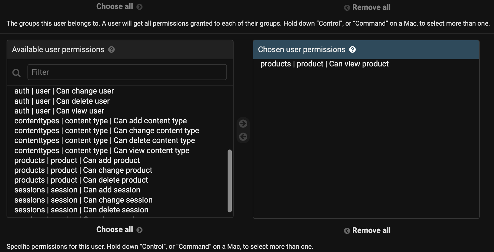
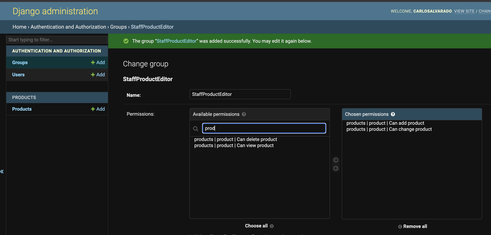
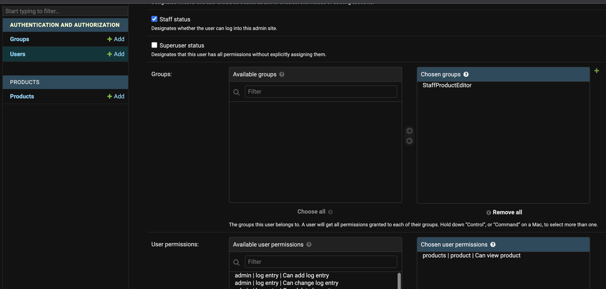
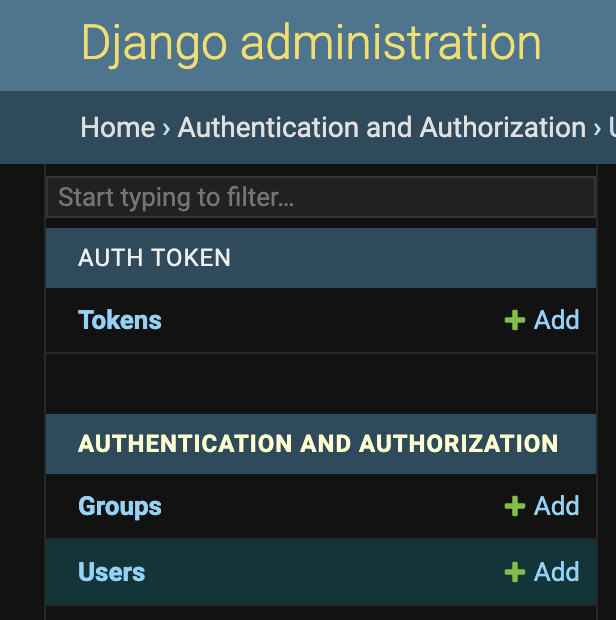
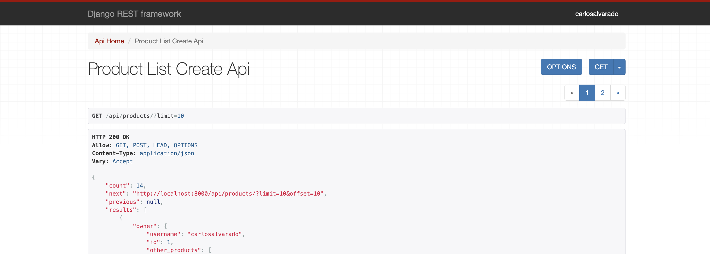

# Django Backend

Django official documentation:
https://www.django-rest-framework.org/

course video: https://www.youtube.com/watch?v=c708Nf0cHrs
course time: 4:08min

## Setup the local env

create a virtual environment

> python3.11 -m venv venv
> source venv/bin/activate

add file requirements.txt with the following info:

> django>=4.00,<4.1.0
> djangorestframework
> pyyaml
> requests
> django-cors-headers

then run the following commands to install the dependencies

> pip install -r requirements.txt
> pip install --upgrade pip

create two folders: backend and client.
navigate to backend folder and run the following command to install the framework

> django admin startproject cfehome .

## Run the local env

run the server

> source venv/bin/activate
> cd backend/
> python3 manage.py runserver 8000

run a client file:

> python3 client/details.py

## Session Authentication && Permissions

## Views as an REST API

We import libs from the framework
from rest_framework import generics, mixins, permissions
from rest_framework.decorators import api_view
from rest_framework.response import Response
from django.shortcuts import get_object_or_404

these generic views, function based view or the mixins allow to create class methods that automate a lot of the work for a REST API, it handes status codes, updates to database, args handling, permissions and more.

### Permissions

Generics views can use permission classes.
from rest_framework import permissions
https://docs.djangoproject.com/en/4.2/topics/auth/default/

## Authentication

we need to create a super user
navigate to the backend folder.

> python3 backend/manage.py createsuperuser

for this project, it is left as: carlosalvarado
for testing purposes, password is 1234
navigate to admin panel:

> localhost:8000/admin/

creating another user named: staff, with password sept2023

Custom Models can be added to the admin view, go to admin.py inside the model folder Product:
add this line:

> from .models import Product
> admin.site.register(Product)

then special permissins need to be given to each user to do things with the modules
http://localhost:8000/admin/

when Login, i have a session that is read by the API viewer.
http://localhost:8000/api/products/
it can create registers at the bottom

in the admin, you can also create a group for special permission, eg:

Then it can be added to a specific user:

so there are two level of permission, at the user itself, or at a group.

### Custom permissions

We create the file. permissions.py inside the models folder, in this case products.
we create the class: IsStaffEditorPermission
inside it we def a method: has_permission

> def has_permission(self, request, view):
> user = request.user
> print('into IsStaffEditorPermission')
> print(user.get_all_permissions())
> if user.is_staff:
> if user.has_perm("products.view_product"):
> return True
> return False
> return False

note: on the built in admin tool, permissions can be tested, you can access different tables or data, and test different actions as only see, edit, create or delete.

### Token authentication

we need to add a built-in module from rest_framework, the authtoken.
into the cfehome directory, look for settings, look for the array of INSTALLED_APPS, and add:

> INSTALLED_APPS = [
>
> > ..,
> > 'rest_framework.authtoken',
> > ...
> > ]

then make sure to run migrations.

> python3 backend/manage.py migrate

now i got a tokens table.

then adding, a rest api to get the tokem, inside api urls.py

> from rest_framework.authtoken.views import obtain_auth_token
> .. and the urlspatters:
> path('auth/', obtain_auth_token)

Lastly, in the products views, we need to add the atuthentication method for auth.

> authentication_classes = [
>
> > authentication.SessionAuthentication,
> > authentication.TokenAuthentication
> > ]

then, the client needs to change the wait is making its calls to the api.
eg. client/list.py
first get the token and then add it as a hearder.

> endopoint = "http://localhost:8000/api/products/"

    token = get_auth_token_response.json()['token']
    headers = {
        "Authorization": f"Token {token}"
    }

Note. Django authentication works with 'Token' authorization, if we want to use Bearer, we need to modify a bit (override) the exitsint.
so e add a authorization.py file in the API directory.

in authorization.py

> from rest_framework.authentication import TokenAuthentication as BaseTokenAuth
> class TokenAuthentication(BaseTokenAuth)
> keyword = 'Bearer'

then we add our custom method to override the authentication method in views.py of products module.

## A default pattern to reuse auth models.

so far we have built specefic use cases for our product model. how about reusing some in different new modules?
we refer to their documentation: https://www.django-rest-framework.org/#installation:~:text=DEFAULT_PERMISSION_CLASSES

> 'DEFAULT_PERMISSION_CLASSES': [>
>
> > 'rest_framework.permissions.DjangoModelPermissionsOrAnonReadOnly'
> > 'WE REFER TO THE PATH'
> > ]

## Using Mixins for persmissions. (video: 3:08)

For this we had to move our permission.py file from the specific product module into the api directory, so it goes broad.
then we create a mixins file, and we add the class StaffEditorPermissionMixin() where we declare the permissions.

from it we can now import into our views as an inyected mixin. eg.

> class ProductListCreateAPIView(StaffEditorPermissionMixin, generics.ListCreateAPIView):

## ViewSets and Routers. (video: 3:13)

we create a viewset as a mixin, as a modular way to have it.

> from .models import Product
> from .serializers import ProductSerializer

> class ProductViewSet(viewsets.ModelViewSet):
> queryset = Product.objects.all()
> serializer_class = ProductSerializer
> lookup_field = 'pk' #default

and we create a routes.py file under the cfehome directory.

> from rest_framework.routers import DefaultRouter
> from products.viewsets import ProductViewSet
> router = DefaultRouter()
> router.register('products-abc', ProductViewSet, basename='products')
> urlpatters = router.urls

the hour urls file needs to add the routers module.

> path('api/v2/', include('cfehome.routers')), # our v2 routers version

then: http://localhost:8000/api/v2/ responds with
{
"products-abc": "http://localhost:8000/api/v2/products-abc/"
}

## URLs, reverse and serializers (video: 3:25)

we add a new url serializer, `url = serializers.SerializerMethodField(read_only=True)` datapoint

    # this is a way to autocomplete the url value for the field, how does "url" listed in the fields array fetches whats in the get_url def function?
    # apparently this is part of the magic of django, connecting the field with its get_ prefix, the same happens with disccount.
    > def get_url(self, obj):
    >     return f'/api/products/{obj.id}'

    # another elegant way is to use the built-in reverse() function from rest_framework, this works specially well (and only) with ModelSerializer. adding: from rest_framework.reverse import reverse

    # as the first argument of the reverse func, we need to reference the name of the url, so we added this extra param to the urls.py in products dir.

    > def get_url(self, obj):
    >    request = self.context.get('request') #self.request
    >   if request is None:
    >        return None
    >    return reverse("", kwargs={"pk": obj.ud}, request=request)

## Model Serializer Create and Update Methods. (video: 3:34)

wanting to hide, or update fields that are not listed in the model? we can, watch the video for understanding, but not something commited in the code as its not that common

## Custom Validation with Serializers (video: 3:41)

adding a func def with validate\_<field_name> (prefix) will do the trick, this is data coming in from the create, or update methods.

## Request User Data & Customize View Queryset (video: 3:53)

for this we adjust models.py under products directory.

from django.db import models
from django.conf import settings
User = settings.AUTH_USER_MODEL # auth.User

class Product(models.Model):
user = models.ForeignKey(User, default=1, null=True, on_delete=models.SET_NULL)

we run the migration using:

> python3 backend/manage.py makemigrations
> python3 backend/manage.py migrate

after we run, we can see users are attached to products in the admin panel, still we need to enchance our serializer to see the data thru the endopoint.

## Related fields and foreign key serializer (video: 4:09)

instead of using the built-in SerializerMethodField to generate a getter for the user data

> user_data = serializers.SerializerMethodField(read_only=True)

we better separate a module, called serializers.py

## Pagination (video 4:24)

to do this we adjust cfehome/settings, and add:

> "DEFAULT_PAGINATION_CLASS": "rest_framework.pagination.LimitOffsetPagination",
> "PAGE_SIZE": 10

And we get nice pagination built-in out of the box:

Also the url is automatically modified: http://localhost:8000/api/products/?limit=10&offset=10

## A Django Based Search for our Product API

For this exercise we added a public key to the product schema (Product Model)
for every change in the model, it means a change in the db schema, so we need to run the migrations.

> python3 backend/manage.py makemigrations
> python3 backend/manage.py migrate

then in order to test this better, we added a new client app using the django framework for easy setup.

> python3 backend/manage.py startapp search

and then modify the file search/views.py

Also we add urls.py into search directory.

urlpatterns = [
path('', views.SearchListView.as_view(), name='search')
]

and we add the new module - app search into settings.
